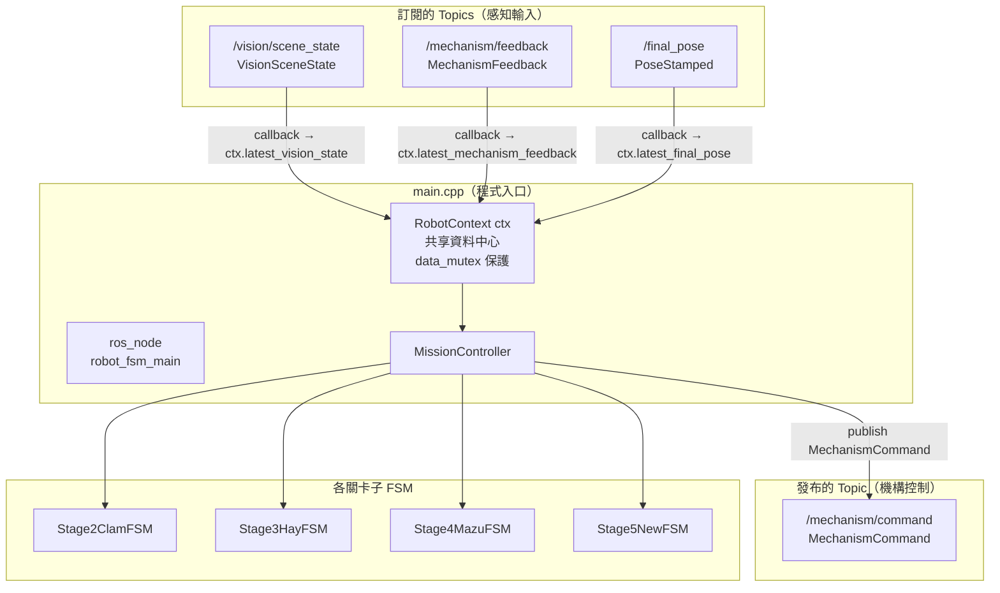
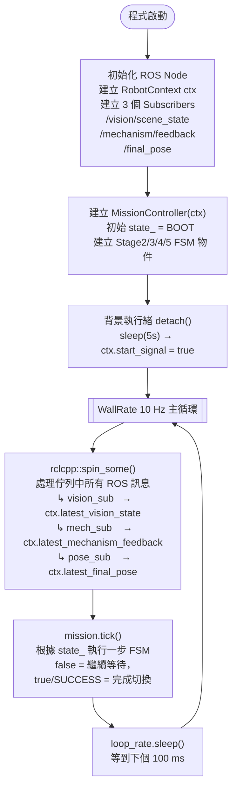
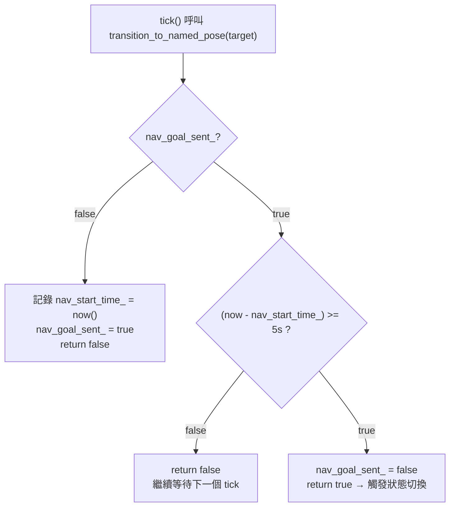
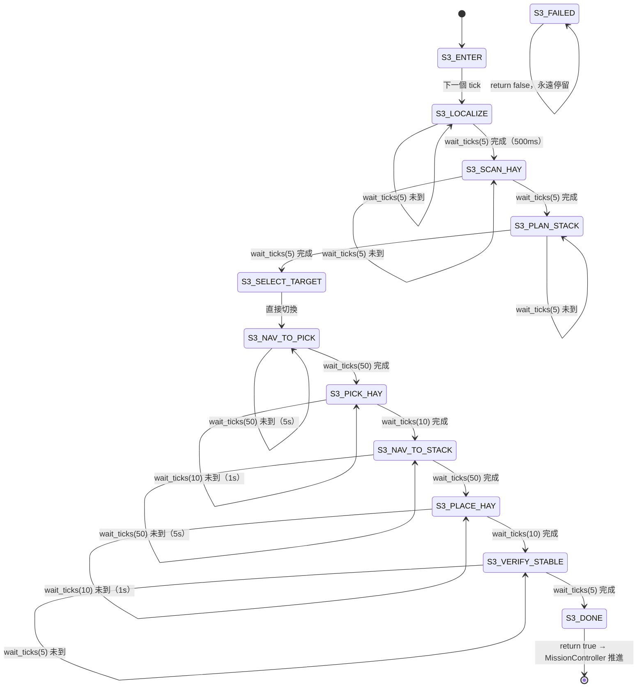
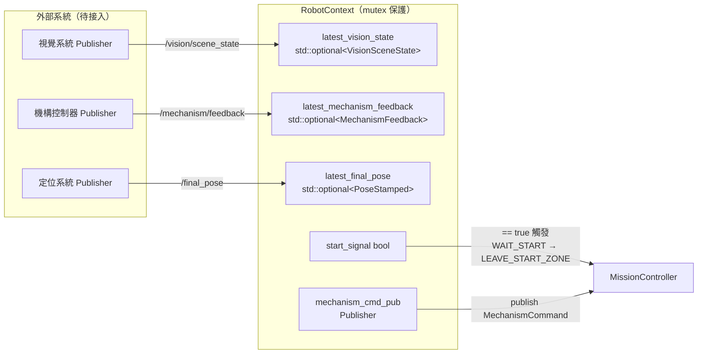

# Robot FSM v2 架構文件

---

## 1. 系統元件總覽



---

## 2. 主循環流程（每 100 ms）



---

## 3. MissionController 頂層狀態機

> 每個 tick 只執行一個 `case`；需要等待的 state 會在原地重複直到條件滿足。

```mermaid
stateDiagram-v2
    direction TB
    [*] --> BOOT : 程式啟動

    BOOT --> INIT : 立即切換

    INIT --> SELF_CHECK : init_system() = true\n建立 mechanism_cmd_pub
    INIT --> SAFE_STOP  : init_system() = false

    SELF_CHECK --> WAIT_START : self_check() = true
    SELF_CHECK --> SAFE_STOP  : self_check() = false

    WAIT_START --> WAIT_START       : ctx.start_signal == false\n每 tick 輪詢
    WAIT_START --> LEAVE_START_ZONE : ctx.start_signal == true\n（背景執行緒 5s 後觸發）

    LEAVE_START_ZONE --> LEAVE_START_ZONE : 計時中（5s）
    LEAVE_START_ZONE --> STAGE2_CLAM      : 計時完成

    STAGE2_CLAM --> STAGE2_CLAM          : stage2_fsm.tick() = false
    STAGE2_CLAM --> TRANSITION_TO_STAGE3 : stage2_fsm.tick() = true

    TRANSITION_TO_STAGE3 --> TRANSITION_TO_STAGE3 : 計時中（5s）
    TRANSITION_TO_STAGE3 --> STAGE3_HAY            : 計時完成

    STAGE3_HAY --> STAGE3_HAY           : stage3_fsm.tick() = false
    STAGE3_HAY --> TRANSITION_TO_STAGE4 : stage3_fsm.tick() = true

    TRANSITION_TO_STAGE4 --> TRANSITION_TO_STAGE4 : 計時中（5s）
    TRANSITION_TO_STAGE4 --> STAGE4_MAZU           : 計時完成

    STAGE4_MAZU --> STAGE4_MAZU           : stage4_fsm.tick() = false
    STAGE4_MAZU --> TRANSITION_TO_STAGE5  : stage4_fsm.tick() = true

    TRANSITION_TO_STAGE5 --> TRANSITION_TO_STAGE5 : 計時中（5s）
    TRANSITION_TO_STAGE5 --> STAGE5_NEW            : 計時完成

    STAGE5_NEW --> STAGE5_NEW      : stage5_fsm.tick() = RUNNING
    STAGE5_NEW --> FINISH_DECISION : stage5_fsm.tick() = SUCCESS

    FINISH_DECISION --> END_RUN    : finish_decision() = true
    FINISH_DECISION --> EARLY_STOP : finish_decision() = false

    EARLY_STOP --> END_RUN
    END_RUN    --> END_RUN    : 任務結束，呼叫 rclcpp::shutdown()
    SAFE_STOP  --> SAFE_STOP  : 錯誤停止
```

---

## 4. 導航計時器 Pattern（transition_to_named_pose）

> 目前為模擬模式，每次導航等待 5 秒。替換為真實 Action Client 時只需改此函式。



---

## 5. Stage3HayFSM 子狀態機

> 所有關卡 FSM 採用相同的 `wait_ticks(N)` 模擬模式，真實感測/導航邏輯待後續填入。



---

## 6. Stage5NewFSM 子狀態機（StageStatus 回傳版）

> Stage5 回傳 `StageStatus` enum（RUNNING / SUCCESS / FAILURE），其餘關卡回傳 `bool`。

```mermaid
stateDiagram-v2
    [*] --> ENTER
    ENTER   --> LOCALIZE : return RUNNING
    LOCALIZE --> LOCALIZE : wait_ticks(5) 未到
    LOCALIZE --> SCAN     : wait_ticks(5) 完成（500ms）
    SCAN    --> SCAN      : wait_ticks(5) 未到
    SCAN    --> PLAN      : wait_ticks(5) 完成
    PLAN    --> PLAN      : wait_ticks(5) 未到
    PLAN    --> EXECUTE   : wait_ticks(5) 完成
    EXECUTE --> EXECUTE   : wait_ticks(8) 未到（800ms）
    EXECUTE --> VERIFY    : wait_ticks(8) 完成
    VERIFY  --> VERIFY    : wait_ticks(3) 未到
    VERIFY  --> DONE      : wait_ticks(3) 完成
    DONE    --> [*]       : return StageStatus::SUCCESS
```

---

## 7. RobotContext 資料流



---

## 設計概念整理

| 概念 | 說明 |
|------|------|
| **非阻塞 FSM** | 每個 state 每次只執行「一小步」，`false`/`RUNNING` = 繼續等，`true`/`SUCCESS` = 完成 |
| **spin_some + tick 分離** | `spin_some` 更新 ctx 資料 → `tick` 讀取 ctx 做決策，兩者責任清晰 |
| **RobotContext 共享** | 所有 FSM 持有同一個 ctx 指標，感知資料只寫一次，全局可讀 |
| **wait_ticks 模擬** | `tick_count_++` 計數，達到 N 後重置並回傳 true，模擬等待時間 |
| **導航計時器** | `transition_to_named_pose` 用 `rclcpp::Time` 計時 5 秒取代真實 Action Client |
| **StageStatus vs bool** | Stage2/3/4 回傳 `bool`，Stage5 回傳 `StageStatus`（RUNNING/SUCCESS/FAILURE） |

---

## 接入真實感測/導航的步驟

| 項目 | 目前（模擬） | 替換為真實版 |
|------|------------|------------|
| 關卡間導航 | `transition_to_named_pose` 計時 5s | 改為 `async_send_goal` 至 Nav2 Action Server |
| 各關卡內部 | `wait_ticks(N)` | 填入真實視覺判斷、機構 feedback 等待邏輯 |
| 視覺資料 | 未使用（optional 空值） | 發布 `/vision/scene_state` → ctx 自動更新 |
| 機構回饋 | 未使用（optional 空值） | 發布 `/mechanism/feedback` → ctx 自動更新 |
| 起始訊號 | 背景執行緒 5s 後設 flag | 改為 ROS topic/service 接收競賽開始訊號 |
