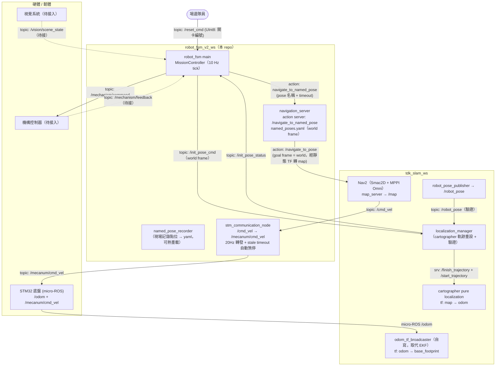
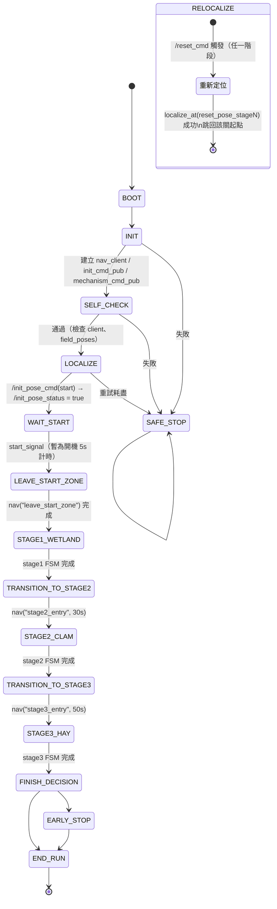

# TDK 30th — robot_fsm_v2_ws（任務主程式 FSM）

TDK 30 屆競賽機器人的**任務決策主程式**，採非阻塞式 FSM 架構，與定位導航 workspace [`tdk_slam_ws`](https://github.com/terryking0711/tdk_slam_ws) 搭配運作：本 ws 決定「現在做什麼」，透過 action / topic 呼叫 `tdk_slam_ws` 的定位初始化與 Nav2 導航。

- 分支：`real-robot-test`（實機用）
- 環境：ROS2 Humble + Docker（`docker/`）

---

## 整體系統架構（跨兩個 workspace）



---

## 頂層任務狀態機（MissionController）

主循環 10 Hz，每個 tick 只走一小步（非阻塞）；`false / RUNNING` = 原地等待，`true / SUCCESS` = 切換狀態。



### 兩條關鍵非阻塞流程

| 流程 | 機制 |
|------|------|
| **定位初始化**（`localize_at`） | 發布 `/init_pose_cmd`（world frame）→ 每 tick 輪詢 `/init_pose_status` → 逾時重送，重試耗盡進 `SAFE_STOP` |
| **導航**（`transition_to_named_pose`） | `async_send_goal` 到 `/navigate_to_named_pose`（只建一次 client，全程重用）→ result callback 設定 `nav_done_` → 失敗有 backoff 重試 |

---

## 套件結構

| 套件 | 內容 |
|------|------|
| `robot_fsm` | 主程式 `main.cpp`、`MissionController`、Stage1（濕地）/ Stage2（蛤蜊）/ Stage3（稻草）子 FSM、`stm_communication_node`、teleop / 測試 launch |
| `robot_navigation` | `navigation_server`（named pose → Nav2 action 轉發、逾時管理、`/reload_named_poses` 熱重載）、`named_pose_recorder`、`named_poses.yaml` |
| `robot_interfaces` | `NavigateToNamedPose.action`、`SaveNamedPose.srv`、`MechanismCommand/Feedback`、`VisionSceneState`、`StageResult` |

## 座標系約定

- **所有點位使用 world frame**（場地最左下角 = (0,0)）：`named_poses.yaml`、`/init_pose_cmd`、main.cpp 的 `field_poses` 參數皆同
- `world = map + (0.425, 1.0)`，由 `tdk_slam_ws` 的靜態 TF 轉換，Nav2 goal 直接吃 world frame

## 如何使用

```bash
# 在 Docker 容器內建置
cd /workspaces/robot_fsm_v2_ws
./build_fsm.sh

# 也可以直接在 workspace 根目錄執行正常的 colcon build
# colcon build

# 每個新 terminal 只載入這份 workspace
source /workspaces/robot_fsm_v2_ws/use_fsm.sh
ros2 pkg prefix robot_fsm
# 必須顯示 /workspaces/robot_fsm_v2_ws/install/robot_fsm

# 執行時請 source use_fsm.sh，不要直接 source install/setup.bash。

# 先啟動 tdk_slam_ws（agent / spawn_launch / nav_launch，共 3 個 terminal）

# Terminal A — cmd_vel 橋接
ros2 launch robot_fsm nav_cmd_bridge.launch.py

# Terminal B — navigation_server
ros2 launch robot_navigation navigation_server.launch.py

# Terminal C — 主程式
ros2 run robot_fsm robot_fsm_main

# 場外重置（隊員將機器人搬到第 N 關重置點後）
ros2 topic pub --once /reset_cmd std_msgs/msg/UInt8 "{data: 2}"
```

---

## 目前進度

- ✅ 非阻塞 FSM 骨架：`spin_some` + `tick` 分離、`RobotContext` mutex 共享
- ✅ **真實 Nav2 導航鏈**：`NavigateToNamedPose` action → `navigation_server` → Nav2 `/navigate_to_pose`，含逾時、backoff 重試、goal response / result callback
- ✅ **定位初始化整合**：`LOCALIZE` / `RELOCALIZE` 狀態透過 `/init_pose_cmd` ↔ `/init_pose_status` 與 `localization_manager` 串接
- ✅ 場外重置流程（`/reset_cmd` → `RELOCALIZE` → 跳回該關）
- ✅ `stm_communication_node`：`/cmd_vel` → `/mecanum/cmd_vel` 20Hz 轉發 + stale timeout 自動送零速
- ✅ `named_pose_recorder` + `/reload_named_poses` 熱重載
- ✅ 起點 → 第三關的展示流程可跑通

## 未完成 / 已知問題

- ❌ **各關卡子 FSM 內部仍為 `wait_ticks` 模擬**：機構動作只發 `/mechanism/command`，尚無真實 feedback 等待邏輯
- ❌ **視覺 `/vision/scene_state`、機構 `/mechanism/feedback`、`/final_pose` 尚無 publisher**（介面已留好）
- ❌ **比賽開始訊號**仍為開機 5 秒計時模擬，需改為實體訊號
- ⬜ `named_poses.yaml` 與 `reset_pose_stage1~4` 為佔位座標，待實際場地量測後更新
- ⬜ Stage4（媽祖）/ Stage5 程式碼存在但未接入主流程
