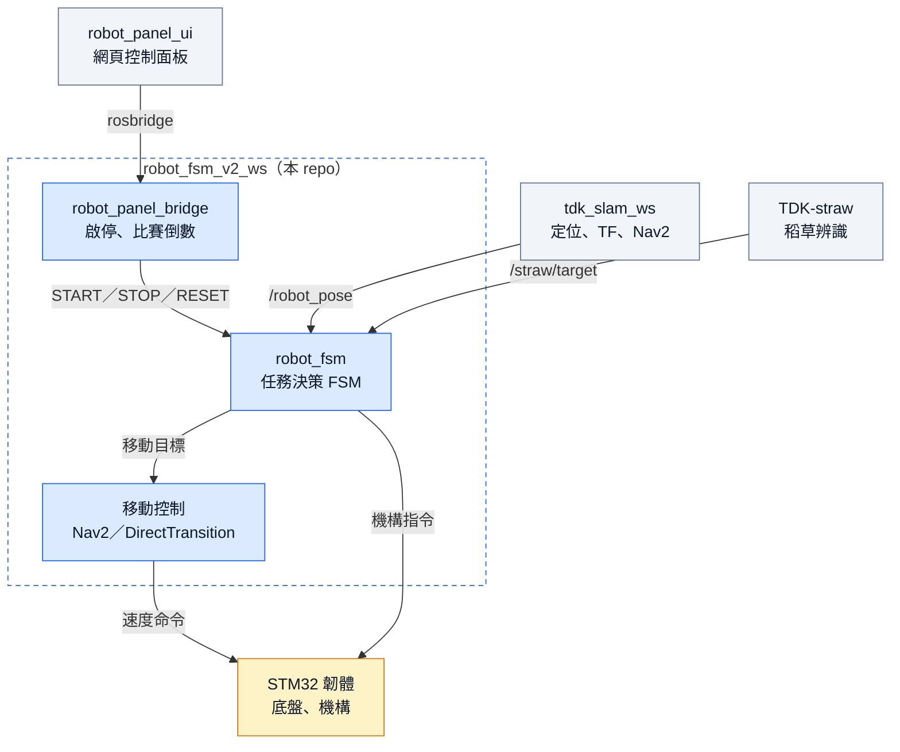
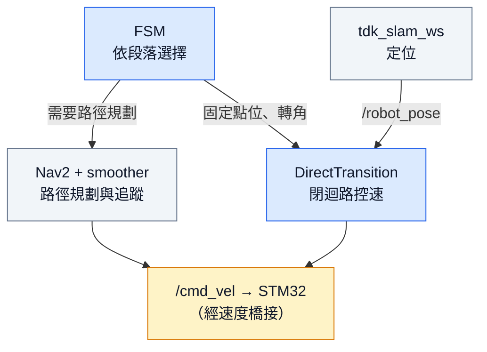
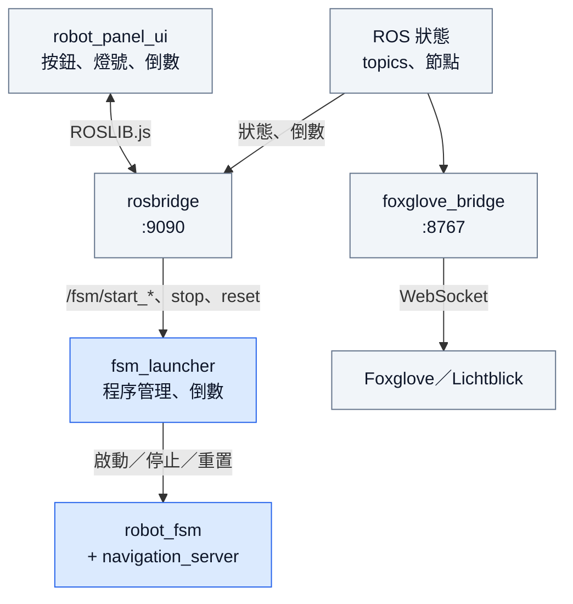
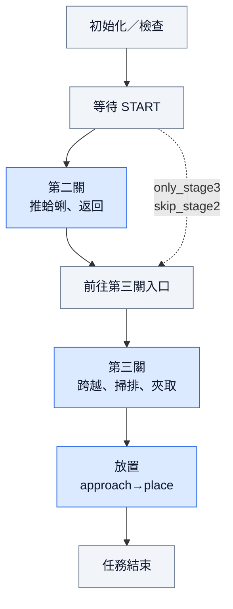
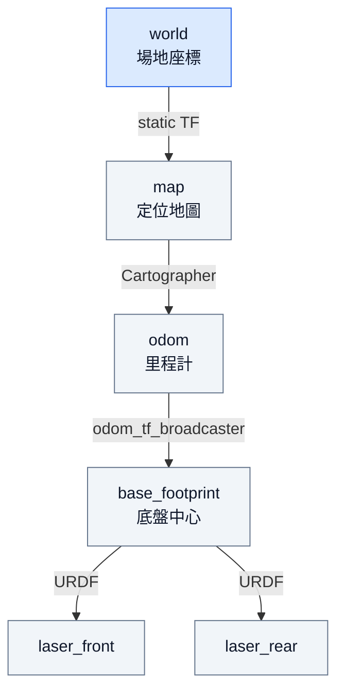

# TDK 30th — Robot FSM

TDK 30 屆競賽機器人的任務主程式，以 **ROS 2 Humble、C++ 與非阻塞有限狀態機（FSM）** 協調定位導航、視覺辨識及 STM32 機構控制，完成關卡移動、稻草收集與放置。

本專案保留作為個人作品與後續開發參考。設計重點是把 **「任務順序」「移動控制」「機構與感知回授」** 分開管理，再由 FSM 決定何時執行、等待、切換或停車。以下以實機使用的第二、三關流程為主，其他 workspace 僅介紹與 FSM 的整合關係。

## 目錄

1. [系統架構](#1-系統架構)
2. [套件與通訊](#2-套件與通訊)
3. [移動控制](#3-移動控制)
4. [開發與視覺化工具](#4-開發與視覺化工具)
5. [快速啟動與面板](#5-快速啟動與面板)
6. [FSM 實作細節](#6-fsm-實作細節)
7. [介面一覽](#7-介面一覽)

---

## 1. 系統架構


```mermaid
flowchart TB
    UI["robot_panel_ui<br/>網頁控制面板"]
    SLAM["tdk_slam_ws<br/>定位、TF、Nav2"]
    VISION["TDK-straw<br/>稻草辨識"]

    subgraph WS["robot_fsm_v2_ws（本 repo）"]
        BRIDGE["robot_panel_bridge<br/>啟停、比賽倒數"]
        FSM["robot_fsm<br/>任務決策 FSM"]
        MOVE["移動控制<br/>Nav2／DirectTransition"]
    end

    STM["STM32 韌體<br/>底盤、機構"]

    UI -->|rosbridge| BRIDGE
    BRIDGE -->|START／STOP／RESET| FSM
    SLAM -->|/robot_pose| FSM
    VISION -->|/straw/target| FSM
    FSM -->|移動目標| MOVE
    MOVE -->|速度命令| STM
    FSM -->|機構指令| STM

    classDef ours fill:#dbeafe,stroke:#2563eb,color:#0f172a
    classDef ext fill:#f1f5f9,stroke:#64748b,color:#0f172a
    classDef hw fill:#fef3c7,stroke:#d97706,color:#0f172a
    class BRIDGE,FSM,MOVE ours
    class UI,SLAM,VISION ext
    class STM hw
    style WS fill:none,stroke:#2563eb,stroke-dasharray:5 4
```

> 藍色：本 repo　灰色：其他 repo　黃色：硬體。為了好讀，圖中省略回授路徑（`/odom`、夾取狀態、導航結果），細節見[移動控制](#3-移動控制)與[介面一覽](#7-介面一覽)。

- **FSM 是決策中心**：根據目前關卡、導航結果、定位、視覺與機構狀態決定下一步。
- **兩種移動方式**：Nav2 與直接控速用於不同移動段落，依任務狀態切換。
- **面板與後端**：面板透過後端操作 FSM；底層定位、感測器與 micro-ROS 由配套系統啟動。
- **共用場地設定**：`field_config.yaml` 決定地圖、TF、點位與場地控制設定；Docker 與啟動腳本負責載入配套服務。

### 跨 repo 關係

| Repo／workspace | 與 FSM 的關係 |
| --- | --- |
| [tdk_slam_ws](https://github.com/terryking0711/tdk_slam_ws/tree/tmep_ver) | 提供 Cartographer 定位、TF、`/robot_pose`、定位初始化與 Nav2（Smac2D + MPPI Omni） |
| `TDK-straw` | 使用 OpenCV 的 HSV 色彩與幾何分析偵測稻草，透過 `/straw/target` 提供第三關對準資訊 |
| `microros_ws` | 提供 micro-ROS Agent 與相關容器服務，銜接 ROS 2 和 STM32；韌體負責實際底盤及機構執行 |
| [robot_panel_ui](https://github.com/terryking0711/robot_panel_ui) | 透過 rosbridge 顯示狀態、呼叫 launcher services，不直接實作關卡邏輯 |
| [tdk_robot_docker](https://github.com/terryking0711/tdk_robot_docker) | 統整 Docker、桌面啟動腳本、`field_config.yaml` 與跨 workspace 執行環境 |

<!-- 在此加入 TDK-straw 辨識圖片／實機影片 -->

---

## 2. 套件與通訊

### FSM 運作方式

主程式以 **10 Hz tick** 推進狀態，每次只執行一小步；等待導航或機構時仍持續處理 ROS callbacks。

| 元件 | 職責 |
| --- | --- |
| `RobotContext` | 保存最新回授與共用設定 |
| `MissionController` | 管理整體流程 |
| 第二、三關子 FSM | 管理關卡內動作 |

### 套件分工

| 套件 | 職責與主要技術 |
| --- | --- |
| `robot_fsm` | C++／rclcpp 非阻塞 FSM、機構指令、視覺與夾取回授、直接控速、速度橋接 |
| `robot_navigation` | rclcpp_action 封裝 Nav2、named poses YAML、逾時與精對位、Python 點位視覺化工具 |
| `robot_interfaces` | 自訂機構訊息、夾取狀態及 `NavigateToNamedPose.action`，定義模組間介面 |
| `robot_panel_bridge` | Python／rclpy services、FSM 子程序管理、比賽倒數與主機電池監控 |
| `straw_interfaces` | 本 workspace 內另附的稻草訊息套件，供 FSM 接收 TDK-straw 偵測結果 |

### 通訊方式

| 機制 | 用途 |
| --- | --- |
| **topics** | 位姿、視覺、速度與機構狀態 |
| **actions** | 導航目標與結果 |
| **services** | 啟停、重置與點位重載 |
| **TF** | 統一場地、地圖、里程計與車體座標 |

STM32 透過 micro-ROS 參與 ROS 通訊。

---

## 3. 移動控制

### 從 Nav2 到閉迴路控速

開發初期使用 Nav2 執行點位移動，但在本麥輪機器人與競賽場地上，移動表現不易調整到符合需求，調參成本高。後來針對固定點位與關卡移動實作 **`DirectTransition` 閉迴路控速**，在實機使用上更容易取得需要的移動表現。

#### 使用 Nav2 的實機效果

https://github.com/user-attachments/assets/20d47f27-70ef-4f53-84d4-dda88f34d5d7

#### 使用控速的實際效果

https://github.com/user-attachments/assets/02b318e7-a96c-47ff-a192-95f5787f165d

### 兩條控制路徑


```mermaid
flowchart TB
    FSM["FSM<br/>依段落選擇"]
    LOC["tdk_slam_ws<br/>定位"]
    NAV["Nav2 + smoother<br/>路徑規劃與追蹤"]
    DT["DirectTransition<br/>閉迴路控速"]
    OUT["/cmd_vel → STM32<br/>（經速度橋接）"]

    FSM -->|需要路徑規劃| NAV
    FSM -->|固定點位、轉角| DT
    LOC -->|/robot_pose| DT
    NAV --> OUT
    DT --> OUT

    classDef ours fill:#dbeafe,stroke:#2563eb,color:#0f172a
    classDef ext fill:#f1f5f9,stroke:#64748b,color:#0f172a
    classDef hw fill:#fef3c7,stroke:#d97706,color:#0f172a
    class FSM,DT ours
    class NAV,LOC ext
    class OUT hw
```

- **Nav2 路徑**：`navigation_server` 送出命名點位 action，Nav2 輸出 `/cmd_vel_nav`，經 `velocity_smoother` 成為 `/cmd_vel`。
- **直接控速路徑**：`DirectTransition` 讀取 `/robot_pose`，直接發布 `/cmd_vel`。
- **回到 FSM**：Nav2 回報成功／失敗／取消；直接控速回報到位／逾時／等待。
- **速度輸出**：速度橋接以 20 Hz 送 `/mecanum/cmd_vel` 經 micro-ROS 到 STM32；STM32 回傳 `/odom` 給定位系統。
- **切換保護**：直接控速前會等待導航結束及速度沉降，避免與 smoother 的剩餘輸出交錯。

### 控制器運作

- **誤差計算**：持續讀取 `/robot_pose`，計算 world 座標下的位置與朝向誤差。
- **速度輸出**：轉換成車體速度送到 `/cmd_vel`。
- **可調參數**：依目標設定速度上限、位置／角度容差、穩定週期與逾時策略；並可限制加減速、接近目標時減速。
- **停止與銜接**：位姿過期時停車；標準速度橋接也會在輸入過期時送零。達成條件後由 FSM 接續機構或下一段移動。

### 控制方式比較

| 控制方式 | 在 FSM 中的用途 |
| --- | --- |
| Nav2 | 需要路徑規劃的導航段落，由 `navigation_server` 管理目標與結果 |
| `DirectTransition` | 固定入口、轉角與放置點等段落，利用定位回授直接控制；mirror／DIT 多個段落採此方式 |
| 關卡內控速 | 第三關掃排、換排與視覺對準，結合位姿、目標與機構回授決定速度及停車時機 |

> [!NOTE]
> 直接控速仍依賴定位品質與場地路徑安排，沒有 Nav2 同等的路徑規劃與動態避障功能。兩種方式由 FSM 依段落使用，這也是本專案從通用導航轉向任務導向控制的重要設計經驗。

<!-- 在此加入 Nav2 與閉迴路控速的實機對比影片，可附場地與測試條件 -->

---

## 4. 開發與視覺化工具

### 地圖、點位與移動疊圖

`plot_named_poses.py` **不需要啟動 ROS**，讀取場地地圖、world/map 轉換、named poses 與部分 FSM 移動常數，輸出 PNG。

依賴套件：PyYAML、Matplotlib、Pillow

```bash
cd /workspaces/robot_fsm_v2_ws

# 產生所有場地疊圖
python3 src/robot_navigation/scripts/plot_named_poses.py

# 指定場地與輸出目錄
python3 src/robot_navigation/scripts/plot_named_poses.py mirror dit -o /tmp/fsm_maps

# 互動檢視；--full-map 可顯示整張地圖
python3 src/robot_navigation/scripts/plot_named_poses.py mirror --show
```

#### mirror 場地的 named_pose 圖片


#### normal 場地的 named_pose 圖片


> [!NOTE]
> 圖中的定時移動是依控制常數估算的**名目軌跡**，掃排線為參考線，並非實機量測軌跡，也不保證涵蓋所有路線變體。適合檢查座標、朝向與動作方向，實際路徑仍需錄製定位資料驗證。

<!-- 在此加入地圖＋座標點＋移動疊圖 -->

### Foxglove／Lichtblick 即時開發

| 工具 | 連線位址 |
| --- | --- |
| Foxglove WebSocket | `ws://<機器人IP>:8767` |
| Lichtblick 網頁入口 | `http://<機器人IP>:8080` |

在 Foxglove 或 Lichtblick 選擇 Foxglove WebSocket 連線即可；bridge 由配套 micro-ROS 容器堆疊啟動。

#### 測試時的 Foxglove 畫面

https://github.com/user-attachments/assets/51f5e700-f228-4988-a69a-81562ab84a24

#### 3D panel 設定

- Display frame 設為 `world`
- 加入 `/map`、TF、`/robot_pose` 與 `/named_poses_markers`，即可對照地圖、機器人位置與目標點

點位 markers 可手動啟動：

```bash
python3 /workspaces/robot_fsm_v2_ws/src/robot_navigation/scripts/named_poses_markers.py \
  --ros-args -p field_side:=mirror
```

此工具偵測 YAML 存檔後會自動更新圖示；`/workspaces/start.sh` 已包含它，整合啟動時不必重複執行。

> [!IMPORTANT]
> **圖示更新不等於導航點位已重載**，需另外呼叫 `navigation_server` 的 `/reload_named_poses`。

<!-- 在此加入 Foxglove／Lichtblick 開發畫面 -->

---

## 5. 快速啟動與面板

### 環境需求

- 以既有 Docker 掛載路徑 `/workspaces` 為例
- 需要相關 workspace、地圖、場地設定與硬體環境
- 系統使用 `ROS_DOMAIN_ID=30`

### 建置

```bash
# ROS 容器內
cd /workspaces/robot_fsm_v2_ws
./build_fsm.sh
source ./use_fsm.sh
```

> [!WARNING]
> `build_fsm.sh` 會清除本 workspace 的 `build/`、`install/`、`log/`。

### 整合啟動（比賽使用）

1. 啟動 `TDK MicroROS` 與視覺。
2. 啟動 `TDK Loc_Normal`／`TDK Loc_Mirror`／`TDK Loc_DIT`：帶起定位、Nav2、launcher 與點位 markers。
3. 開啟 robot_panel，按對應的 START：啟動 FSM 及 navigation_server。

### 面板操作與開發監控


```mermaid
flowchart TB
    UI["robot_panel_ui<br/>按鈕、燈號、倒數"]
    RB["rosbridge<br/>:9090"]
    L["fsm_launcher<br/>程序管理、倒數"]
    F["robot_fsm<br/>+ navigation_server"]
    ROS["ROS 狀態<br/>topics、節點"]
    FB["foxglove_bridge<br/>:8767"]
    V["Foxglove／Lichtblick"]

    UI <-->|ROSLIB.js| RB
    RB -->|/fsm/start_*、stop、reset| L
    L -->|啟動／停止／重置| F
    ROS -->|狀態、倒數| RB
    ROS --> FB
    FB -->|WebSocket| V

    classDef ours fill:#dbeafe,stroke:#2563eb,color:#0f172a
    classDef ext fill:#f1f5f9,stroke:#64748b,color:#0f172a
    class L,F ours
    class UI,RB,ROS,FB,V ext
```

- **START** 設定新的比賽期限；**STOP／RESET** 保留原倒數與路線選擇。
- 燈號依訊息新鮮度及 topic／節點存在判斷；倒數來自 launcher 發布的 `/fsm/match_remaining`。
- Foxglove／Lichtblick 供開發時檢查地圖、座標與即時資料。

操作說明另見 [Robot Panel UI](https://github.com/terryking0711/robot_panel_ui)。

### 直接 launch

已有定位導航與通訊後端時，也可在容器內直接啟動：

```bash
export ROS_DOMAIN_ID=30
source /workspaces/robot_fsm_v2_ws/use_fsm.sh
ros2 launch robot_fsm robot_bringup.launch.py field_side:=mirror skip_stage2_arm:=true
```

> [!NOTE]
> 直接 launch 不會建立面板 launcher 的比賽倒數；比賽計時與 RESET 操作請使用面板整合入口。

---

## 6. FSM 實作細節

### 任務流程


```mermaid
flowchart TB
    INIT["初始化／檢查"] --> WAIT["等待 START"]
    WAIT --> S2["第二關<br/>推蛤蜊、返回"]
    S2 --> MOVE["前往第三關入口"]
    WAIT -.->|only_stage3<br/>skip_stage2| MOVE
    MOVE --> S3["第三關<br/>跨越、掃排、夾取"]
    S3 --> PLACE["放置<br/>approach→place"]
    PLACE --> DONE["任務結束"]

    classDef stage fill:#dbeafe,stroke:#2563eb,color:#0f172a
    classDef step fill:#f1f5f9,stroke:#64748b,color:#0f172a
    class S2,S3,PLACE stage
    class INIT,WAIT,MOVE,DONE step
```

| 階段 | 說明 |
| --- | --- |
| **頂層控制** | 處理關卡切換、導航成功／失敗與停止條件，讓關卡子 FSM 專注於動作順序。目前啟動流程沿用既有 Cartographer 定位，`LOCALIZE` 狀態直接放行；程式保留定位初始化請求與結果介面。 |
| **第二關** | 機構準備、入口移動、推蛤蜊、抬臂／收臂與返回；實機面板使用 `skip_stage2_arm` 分支略過部分手臂流程。 |
| **第三關** | 初始化、跨越、進排、掃描對準、等待夾取、退回與換排，最後返回放置。移動與夾取回授互相約束，STM 狀態過期或仍在 PICKING 時停車等待。 |
| **放置與時間管理** | 收集期間剩餘時間小於 40 秒時停止找下一捲，等當次夾取完成，經 `stage3_place_approach` 再到 `stage3_place`。倒數歸零不會直接中斷機構動作。 |

第三關程式位於 `src/robot_fsm/src/stages/stage3_hay_fsm.cpp`，相關說明見 [STAGE3_README.md](STAGE3_README.md)；主流程與條件以目前程式為準。

### 場地與控制設定

| 設定 | 位置／用途 |
| --- | --- |
| 場地入口 | `/workspaces/field_config.yaml`：選擇地圖、TF、點位與 FSM 設定檔 |
| 命名點位 | `src/robot_navigation/config/named_poses_{normal,mirror,dit}.yaml` |
| 控速與指令映射 | `src/robot_fsm/config/fsm_side_{normal,mirror}.yaml`；DIT 共用 mirror 控制設定 |
| 直接控速 | `direct_transition.<目標>`：速度、容差、穩定週期及逾時策略，支援段落的加減速設定 |
| 掃排／換排 | `stage3_row_return_speed`、`stage3_row_return_slow_speed`、`stage3_row_shift_max_speed` 等；部分常數仍在 C++ header |

### 場地模式

| 模式 | 說明 |
| --- | --- |
| NORMAL | 使用 normal 地圖與點位 |
| MIRROR | 使用 mirror 地圖與點位；第三關走 row4 → row3 → row2 → row1 |
| MIRROR V2 | 使用 mirror 地圖；第三關改走 row3 → row1 → row2 |
| DIT | 實驗室第三關測試場地 |

### RESET 與比賽倒數

- launcher 保存截止時間與路線選擇。
- **STOP／RESET**：持續扣除原倒數；RESET 不重建定位。
  - **RESET S2**：從第二關準備開始。
  - **RESET S3**：經轉角及第三關入口重新進關。
- **重新 START** 才設定新期限；重啟 launcher 則會遺失原有記憶體狀態。
- **比賽時間**：normal／mirror 設為 240 秒，DIT 保留 120 秒測試設定，定義於 `fsm_launcher.py`，移植時可依需求修改。

### TF tree 與座標約定


```mermaid
flowchart TB
    world["world<br/>場地座標"]
    map["map<br/>定位地圖"]
    odom["odom<br/>里程計"]
    base["base_footprint<br/>底盤中心"]
    front["laser_front"]
    rear["laser_rear"]

    world -->|static TF| map
    map -->|Cartographer| odom
    odom -->|odom_tf_broadcaster| base
    base -->|URDF| front
    base -->|URDF| rear

    classDef f fill:#f1f5f9,stroke:#64748b,color:#0f172a
    classDef key fill:#dbeafe,stroke:#2563eb,color:#0f172a
    class map,odom,base,front,rear f
    class world key
```

| Transform | 發布者 | 說明 |
| --- | --- | --- |
| `world → map` | `static_transform_publisher` | 依場地設定；目前 `x = 0.425 m`、`y = 1.0 m`、`yaw = 0` |
| `map → odom` | Cartographer（pure localization） | 定位修正 |
| `odom → base_footprint` | `odom_tf_broadcaster` | 依 `/odom` pose 轉發，為實機使用的方式 |
| `base_footprint → laser_*` | `robot_state_publisher`／URDF | 前後 LiDAR 安裝位置 |

- 命名點位與 FSM 定位目標使用 **world frame**，以場地左下角為原點。
- 定位與 TF 由 `tdk_slam_ws` 維護，FSM 利用轉換後的 `/robot_pose` 做控制。

---

## 7. 介面一覽

### 主要 topics

方向以 FSM 系統為基準；速度橋接與監控節點另於用途中標示。

| Topic | 型別 | 方向與用途 |
| --- | --- | --- |
| `/robot_pose` | `geometry_msgs/msg/PoseStamped` | 輸入：world 位姿，供直接控速與關卡判斷 |
| `/init_pose_cmd` | `geometry_msgs/msg/PoseStamped` | 輸出：保留的定位初始化請求介面 |
| `/init_pose_status` | `std_msgs/msg/Bool` | 輸入：保留的定位初始化結果介面 |
| `/straw/target` | `straw_interfaces/msg/StrawTarget` | 輸入：TDK-straw 視覺目標與誤差 |
| `/mechanism/command` | `robot_interfaces/msg/MechanismCommand` | 輸出：機構動作指令 |
| `/mechanism/straw_pick_status` | `robot_interfaces/msg/StrawPickStatus` | 輸入：夾取與機構狀態 |
| `/cmd_vel` | `geometry_msgs/msg/Twist` | 底盤速度輸出，來自當前使用的導航／直接控制流程 |
| `/cmd_vel_nav` | `geometry_msgs/msg/Twist` | Nav2 速度鏈與 navigation_server 精對位使用 |
| `/mecanum/cmd_vel` | `geometry_msgs/msg/Twist` | 標準速度橋接送往底盤，20 Hz；輸入過期自動送零 |
| `/odom` | `nav_msgs/msg/Odometry` | STM32 里程計，供定位導航系統使用 |
| `/fsm/match_remaining` | `std_msgs/msg/Float64` | launcher 發布剩餘秒數，供面板顯示 |
| `/host/battery` | `sensor_msgs/msg/BatteryState` | battery_monitor 發布主機電量 |
| `/named_poses_markers` | `visualization_msgs/msg/MarkerArray` | 點位工具發布的視覺化標記 |

程式另外保留 `/vision/scene_state`、`/mechanism/feedback` 與 `/final_pose` 訂閱介面；目前主要視覺與夾取整合使用上表的 `/straw/target` 和 `/mechanism/straw_pick_status`。

### 主要 actions 與 services

| 介面 | 型別 | 用途 |
| --- | --- | --- |
| `/navigate_to_named_pose` | `robot_interfaces/action/NavigateToNamedPose` | 接收 `target_name` 與 `timeout_sec`，回報成功與訊息 |
| `/navigate_to_pose` | `nav2_msgs/action/NavigateToPose` | navigation_server 呼叫 Nav2 導航 |
| `/spin` | `nav2_msgs/action/Spin` | 指定旋轉／測試流程使用的 Nav2 behavior |
| `/reload_named_poses` | `std_srvs/srv/Trigger` | 重載 navigation_server 的命名點位 |
| `/fsm/start_normal`、`/fsm/start_mirror` | `std_srvs/srv/Trigger` | 啟動對應場地 FSM |
| `/fsm/start_mirror_v2`、`/fsm/start_dit` | `std_srvs/srv/Trigger` | 啟動 V2 路線或 DIT 測試 |
| `/fsm/stop` | `std_srvs/srv/Trigger` | 停止 FSM、取消導航並發送零速度 |
| `/fsm/reset_stage2`、`/fsm/reset_stage3` | `std_srvs/srv/Trigger` | 保留定位、倒數與路線選擇，重啟指定關卡 |

### 修改設定後的生效方式

| 修改內容 | 生效方式 |
| --- | --- |
| named poses YAML | 呼叫 `/reload_named_poses` |
| FSM 控制參數 YAML | 通常需重啟 FSM |
| `mirror_spin_speed_scale` | 由 Nav2 啟動時讀取，需重啟導航 |
| C++ 程式 | 需重新建置 |
